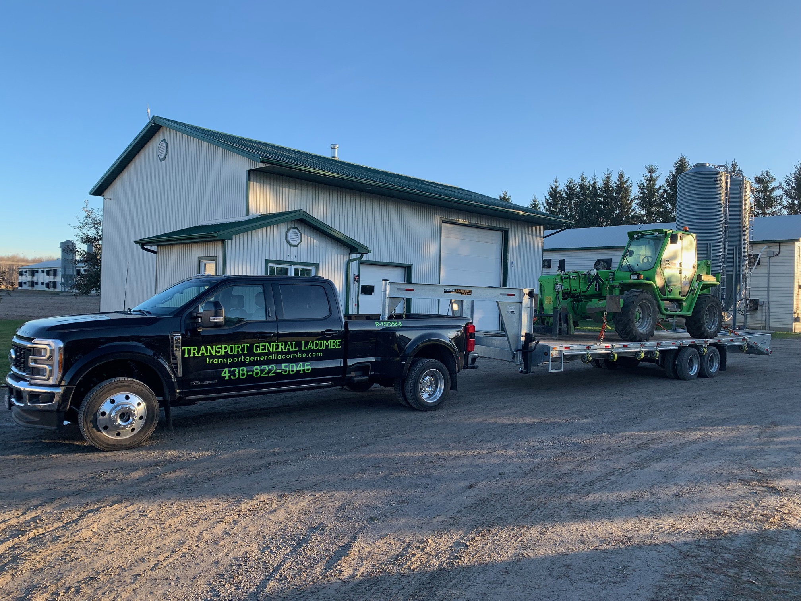

<!-- section 1 (header) -->



 

# Nos services

 

 

### *Nous offrons le transport général sur la Rive-Sud de Montréal et partout ailleurs au Québec!*



 



## Types de marchandises
### Nous sommes là pour livrer la marchandise!
 
Nous pouvons transporter tout ce qui a trait aux machineries, marchandises spécialisées, marchandises toilées, tracteurs, automobiles et camions, etc.
 
 
 
 
 
 

## Lieux
### Nous nous déplaçons partout au Québec! 
 
Notre compagnie a vu les routes de Val-d'Or, de Gatineau, de Québec, de St-Jean sur Richelieu, du Saguenay, de Sherbrooke, de St-Tite et bien plus!
 
 
 
 
 
 

## Qualité et ponctualité
### Notre service est toujours rapide, fiable et efficace!
 
Nous nous spécialisons dans la machinerie, que ce soit dans le domaine agricole ou celui de la construction.  Situés sur la Rive-Sud de Montréal, nous sommes là pour assurer un transport fiable et efficace à toute heure du jour!
 
 
 
 
 
 

## Disponibilités
### Nous sommes rejoignables 24h/24h du lundi au dimanche!
 
Peu importe l'heure qu'il est, nous sommes toujours là pour assurer un transport fiable et efficace!
 
 
 
 
 
 

## Pour les entreprises et les particuliers
### Nous servons autant les entreprises que les particuliers!
 
Transport Général Lacombe s'occupe du transport de marchandises et de matériaux, autant pour les entreprises que les particuliers.
 
 
 
 
 
 

## Spécialisations
### La machinerie, on connaît!
 
Transport Général Lacombe se spécialise dans tout ce qui est machinerie, que ce soit dans le domaine agricole ou celui de la construction.



 

<!-- section 3 (header) -->



 
 
 

<button>[Contactez-nous!](/contact)</button>



